# 流程

```mermaid
flowchart TD
    A[开始] --> B{使用 Zsh}
    B -- 是 --> C[安装 Homebrew]
    B -- 否 --> D(设置 Zsh)
    C --> E[安装 Anaconda]
    D --> C
    E --> F[安装 VSCode]
    F --> G[配置 Python 虚拟环境]
    G --> H[安装 PyTorch]
    H --> I[完成]
    style A fill:#f96,stroke:#333,stroke-width:2px
    style I fill:#f96,stroke:#333,stroke-width:2px
```


# 使用 Zsh
 macOS默认的终端就是Zsh
 
# 安装 Homebrew
打开终端，使用命令行检查是否已经安装了 Homebrew：
```shell
brew --version
```
如果看到 `zsh: command not found: brew` 的错误信息。只需在终端中运行以下命令即可开始安装：
```shell
/bin/bash -c "$(curl -fsSL https://raw.githubusercontent.com/Homebrew/install/HEAD/install.sh)"
```
安装完成后，建议运行 `brew doctor` 检查一切是否正常。

# 安装 Anaconda
 对于 Anaconda，可以通过以下命令安装：
 ```shell
brew search --cask anaconda
brew install --cask anaconda

看到下面的话意味着安装成功：
PREFIX=/opt/homebrew/anaconda3
Unpacking payload ...

Installing base environment...

Preparing transaction: ...working... done
Executing transaction: ...working... 
done
installation finished.
==> **Changing ownership of paths required by anaconda with sudo; the password may**
🍺  anaconda was successfully installed!
```
输入`conda -V`或者`conda --version` 可能看到 `zsh: command not found: conda` 的错误信息。这是因为没有声明全局变量导致终端不识别安装的软件等命令，需要进行配置。根据`PREFIX=/opt/homebrew/anaconda3`配置：
```shell
echo 'export PATH="/opt/homebrew/anaconda3/bin:$PATH"' >> ~/.zshrc
source ~/.zshrc
cat ~/.zshrc
```
此时输入conda -V查看得`conda 24.9.2`，只要有版本号就是对的。

然后换源，因为不在国外，使用官方默认的源可能会有不好的网络下载体验，所以要换成国内的镜像加速源，比如清华源。

默认源：
```shell
conda config --show channels
channels:
  - https://repo.anaconda.com/pkgs/main
  - https://repo.anaconda.com/pkgs/r
```
添加清华源：
```shell
conda config --add channels https://mirrors.tuna.tsinghua.edu.cn/anaconda/pkgs/free
conda config --add channels https://mirrors.tuna.tsinghua.edu.cn/anaconda/pkgs/main
conda config --set show_channel_urls yes
```
会得到：
```shell
conda config --show channels
channels:
  - https://mirrors.tuna.tsinghua.edu.cn/anaconda/pkgs/main
  - https://mirrors.tuna.tsinghua.edu.cn/anaconda/pkgs/free
  - https://repo.anaconda.com/pkgs/main
  - https://repo.anaconda.com/pkgs/r
```

# 安装VSCode
到[官网](https://code.visualstudio.com)下载适用于macOS版本的。

安装完后记得下载适用于python的插件：
```shell
Chinese (Simplified) # 简体中文
Python # 包含Python、Pylance、Python Debugger的整合包
autopep8 # 用来格式化python代码
```

# 配置 Python 虚拟环境

比如在我在vscode中创建了一个名字为`torch_py312`的虚拟环境：
```shell
conda create --name torch_py312 python=3.12
```
然后我在右下角的选择python解释器中选择它，重新打开一个终端，它就被激活了。

默认包：
```python
pip list
Package    Version
---------- -------
pip        25.0
setuptools 75.8.0
wheel      0.45.1
```
默认源：
```python
pip config list

global.index-url='https://mirrors.aliyun.com/pypi/simple/'
```
我的默认是阿里源，就不换了。换源请参考网络上别的文章🙏 
更新一下`pip`：`pip install --upgrade pip` 

# 安装 PyTorch
去到[官网](https://pytorch.org/get-started/locally/)
选择Stable->Mac->Pip->Python->Default，复制命令并在vscode终端激活的`torch_py312`环境中运行：
```python
pip3 install torch torchvision torchaudio
```

## 测试是否成功安装
```python
import torch
# 查看 torch安装是否成功 并查看其版本
print(torch.__version__)
# 查看 mps是否安装成功 是否可用
print(torch.backends.mps.is_available())
# 检查 GPU 是否可用
print(torch.cuda.is_available()) # 对于 CUDA, 返回 False 是正常的
print(torch.backends.mps.is_available()) # 对于 MPS, 应该返回 True
# 获取 MPS 设备
mps_device = torch.device("mps")
print(mps_device) # 输出 "mps"
```
返回下面是正确的
```python
2.6.0
True
False
True
mps
```


# 附录
## 硬件配置

| 硬件组件   | 配置详情                    |
| ------ | ----------------------- |
| 设备型号   | Mac mini                |
| 芯片     | Apple M2                |
| 内存     | 8GB                     |
| 存储空间   | 256GB                   |
| 操作系统版本 | macOS Ventura 13.4.1(c) |

## 对于conda的选择
请参考[这篇文章](https://docs.anaconda.net.cn/distro-or-miniconda/)