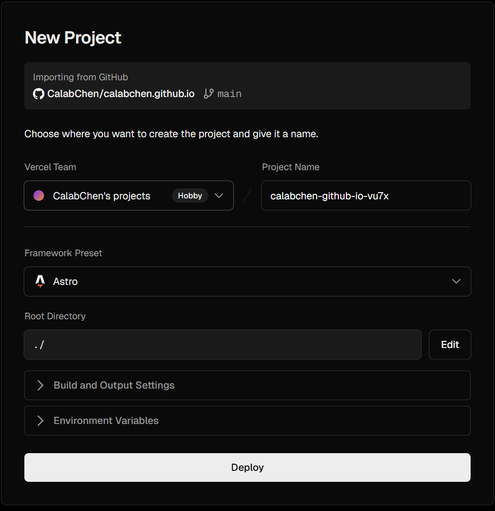

:::caution
随着时间的推移，文章内容可能过期，请关注网上其他文章的最新动态。<br>
本文参考了其他博主的文章，仅供学习参考。
:::

本文介绍如何将这个`Astro`博客模板部署在`Github Pages`和`Vercel`。

# Github Pages
## 克隆模板

根据作者的README进行fork仓库，然后克隆到一台你正在使用的笔记本或台式机上(`Windows/MacOS/Linux`都行)。

## 部署到 `github.io` 网址

在 `astro.config.mjs` 中配置文件设置 [`site`](https://docs.astro.build/zh-cn/reference/configuration-reference/#site) 和 [`base`](https://docs.astro.build/zh-cn/reference/configuration-reference/#base) 选项。
```diff
import { defineConfig } from 'astro/config'

export default defineConfig({  
+ site: 'https://astronaut.github.io',  
+ base: 'my-repo',
})
```
### `site`

`site` 的值必须是以下之一：
- 基于你的用户名的以下网址：`https://<username>.github.io` 
### `base`

可能需要为 `base` 设置一个值，以便 Astro 将你的仓库名称（例如 `/my-repo`）视为你网站的根目录。

:::note
如果出现了以下情况，则不要设置 `base` 参数：
- 你的页面是由根文件夹所提供。
- 你的源码存储库是位于 `https://github.com/<USERNAME>/<USERNAME>.github.io`。
:::

`base` 的值应该是你的仓库名称，以正斜杠开头，例如 `/my-blog`。这样做是为了让 Astro 理解你的网站根目录是 `/my-repo`，而不是默认的 `/`。
> 默认的 `/`代表的是仓库名字`<username>.github.io`，我个人觉得就使用`<username>.github.io`这个仓库，然后设置为`public`，base值就可以不用更改。

:::caution
当配置了这个值后，你所有的内部页面链接都必须以你的 `base` 值作为前缀：
```html
<a href="/my-repo/about">关于本站</a>
```
查看更多关于[配置 `base` 值](https://docs.astro.build/zh-cn/reference/configuration-reference/#base)的信息。
:::

## 配置 GitHub Action

1. 在你克隆的根目录下中的 `.github/workflows/` 目录(没有文件夹就创建文件夹)创建一个新文件 `deploy.yml`，并粘贴以下 YAML 配置信息。下面的文件什么也不用改。
```yaml
name: Deploy to GitHub Pages

on:
  # 每次推送到 `main` 分支时触发这个“工作流程”
  # 如果你使用了别的分支名，请按需将 `main` 替换成你的分支名
  push:
    branches: [ main ]
  # 允许你在 GitHub 上的 Actions 标签中手动触发此“工作流程”
  workflow_dispatch: 

# 允许 job 克隆 repo 并创建一个 page deployment
permissions:
  contents: read
  pages: write
  id-token: write

jobs:
  build:
    runs-on: ubuntu-latest
    steps:
      - name: Checkout your repository using git
        uses: actions/checkout@v4
      - name: Install, build, and upload your site
        uses: withastro/action@v3
        #with:
          # path: . # 存储库中 Astro 项目的根位置。（可选）
          # node-version: 20 # 用于构建站点的特定 Node.js 版本，默认为 20。（可选）
          # package-manager: pnpm@latest # 应使用哪个 Node.js 包管理器来安装依赖项和构建站点。会根据存储库中的 lockfile 自动检测。（可选）

  deploy:
    needs: build
    runs-on: ubuntu-latest
    environment:
      name: github-pages
      url: ${{ steps.deployment.outputs.page_url }}
    steps:
      - name: Deploy to GitHub Pages
        id: deployment
        uses: actions/deploy-pages@v4
```

2. 在 GitHub 上，跳转到存储库的 **Settings** 选项卡并找到设置的 **Pages** 部分。
3. 选择 **GitHub Actions** 作为你网站的 **Source**，然后按 **Save**。
4. 提交（commit）这个新的“工作流程文件”（workflow file）并将其推送到 GitHub。

OK，你的网站现在应该已完成发布了！当你将更改推送到 Astro 项目的存储库时，GitHub Action 将自动为你部署它们。

# Vercel

默认情况下，你的 Astro 项目是一个静态站点。你无需任何额外配置即可将静态 Astro 站点部署到 Vercel。

## 通过网站 UI 部署

直接打开Vercel官网，使用Github的账号登录。
1. [导入你的项目](https://vercel.com/new) 至 Vercel。
2. Vercel 将自动检测 Astro 项目并自动为其配置正确的设置。如下图，**什么都不用动**，直接点击`Deploy`就好。
3. 部署完成。现在可以通过Vercel默认给你分配的二级域名访问博客了。


## 自定义域名

进入部署好的然后点击`Settings`下的`Domains`中，点击`Add`，输入域名。`Add`之后，如果看到下图中的提示（Invalid Configuration）👇,说明要是这个域名解析生效，需要在你的域名商管理后台配置对应的Cname解析和A解析。

### 配置DNS解析

我的域名是在腾讯云买的，前往[官网](https://console.dnspod.cn/dns/list)进行解析。点击域名进行配置。配置如下：

| 记录类型/Type | 主机记录/Name | 记录值/Value               |
| --------- | --------- | ----------------------- |
| CNAME     | www       | `cname.vercel-dns.com.` |
| A         | @         | `76.76.21.21`           |

如果Vercel域名的解析失败了，对于中国国内的用户来说，配置一下单独的解析，依然可以享受 Vercel 提供的服务。将上述步骤中用到的 地址替换成以下内容即可：

A记录地址：`76.223.126.88`或 `76.76.21.98` 等

CNAME 记录地址：`cname-china.vercel-dns.com.`

保存并等待几分钟，域名解析设置将生效。返回Vercel查看，显示成功后可以通过自定义的域名访问网站了。