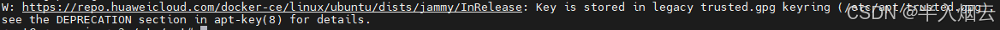
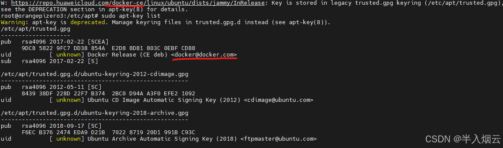
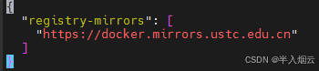

:::caution
随着时间的推移，文章内容可能过期，请关注网上其他文章的最新动态
:::
# 香橙派

## 烧录系统

准备：  
到[香橙派zero3的官网](http://www.orangepi.cn/html/hardWare/computerAndMicrocontrollers/service-and-support/Orange-Pi-Zero-3.html)

> 1.下载用户手册  
> 2.点击官方工具：下载balenaEtcher,mobaxterm  
> 3.在官方镜像里我选择了ubuntu，Orangepizero3_1.0.4_ubuntu_jammy_desktop_xfce_linux6.1.31，是桌面版，因为我的内存是4G，tf卡32G

在balenaEtcher中烧录系统，具体步骤看用户手册

## 启动

插电源，插网线。没有多余的显示器。  
打开mobaxterm使用ssh连接。在家里的路由器（比如说小米）上查看ip地址。

在**session**在选择**ssh**，输入ip和username：root（权限高，方便操作）。

## 测试

```
df -h 查看磁盘使用情况
lsb_release -a 查看操作系统
arch  查看芯片架构
uname -a 查看系统全部信息
```

## ubuntu换源

Ubuntu采用apt作为软件安装工具，其镜像源列表记录在/etc/apt/sources.list文件中。  
首先将sources.list复制为sources.list.bak备份。

```
cd /etc/apt
ls
cp /etc/apt/sources.list /etc/apt/sources.list.bak
```

到[这个地址](https://developer.aliyun.com/mirror/ubuntu?spm=a2c6h.13651102.0.0.3e221b11sXwhNZ)选择对应的阿里源  
**注意芯片架构**  
我换成22.04的阿里源

### 更新镜像源

```
sudo apt-get update #更新软件列表
sudo apt-get upgrade # 更新本地软件
```

小问题：  
  
Key is stored in legacy trusted.gpg keyring (/etc/apt/trusted.gpg), see the DEPRECATION section in apt-key(8) for details.  
首先，这不是一个错误，而是一个警告信息。警告并不会导致程序停止工作，**可以不管**。

如果想查看：  
首先，列出所有添加到你系统中的 GPG 密钥。  
`sudo apt-key list`  
这将显示一个存储在你系统中的巨大的密钥列表。你在这里要做的是寻找与警告信息相关的密钥。



### 配置docker

看用户手册3.24  
**docker换源**  
官方（国外）的源被停了，国内要用国内自己维护的镜像源好点。

```
 cd /etc/docker/
 ls
 会有下面的文件
 daemon.json
 sudo vim daemon.json
```

  
除了这个默认的，添加别的源。  
保存退出后,用以下命令检查是否生效:

```
sudo systemctl daemon-reload 
sudo systemctl restart docker
docker info
```

测试`docker run hello-world`后发现：

> WARNING: The requested image's platform (linux/amd64) does not match the detecte  
> d host platform (linux/arm64/v8) and no specific platform was requested

hello-world 只有x86架构的docker镜像，arm64架构不能用，那怎么行！  
查了网络后发现解决方案：  
在arm架构上运行x86的docker镜像需要使用到QEMU(Quick EMUlator)。QEMU是一个开源的虚拟机和仿真器,它可以模拟多种架构的CPU和设备。下面是安装QEMU的步骤和对应的代码示例:

```
# 安装QEMU
sudo apt-get install qemu binfmt-support qemu-user-static

# 设置binfmt_misc;将x86架构的二进制文件交由QEMU处理
sudo update-binfmts -- enable qemu-x86_64

# 测试
docker run hello-world
```

  
虽然又警告，但是运行成功！

**其实只用在运行时指定平台类型就没有报错了！命令如下：**  
`docker run --platform=linux/amd64 hello-world`  
只要运行x86架构的镜像，就指定`--platform=linux/amd64`

## 宝塔 Linux 面板的安装

用户手册3.27  
等待安装完成~  
注册宝塔账号，选择个人用户免费版就就行。

香橙派zero3安装完后会给出面板登录地址、用户名、密码，请先使用面板账户登录信息，进入面板后再使用官网的账号登录。

默认让安装LNMP/LAMP，我就默认LNMP极速安装（装的软件包deb），默认就好，省心时间快。

呃呃呃呃，可能网络不好，博主下载了一晚上，主要是22：00开始弄，24：00撑不住了，早上起来一看竟然下载了4个小时！  
服了~